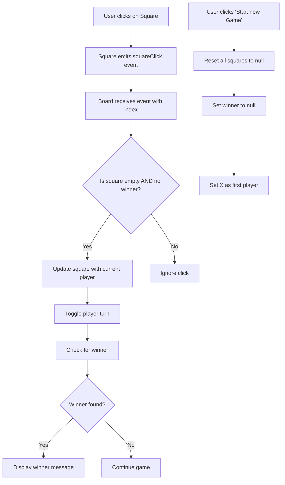
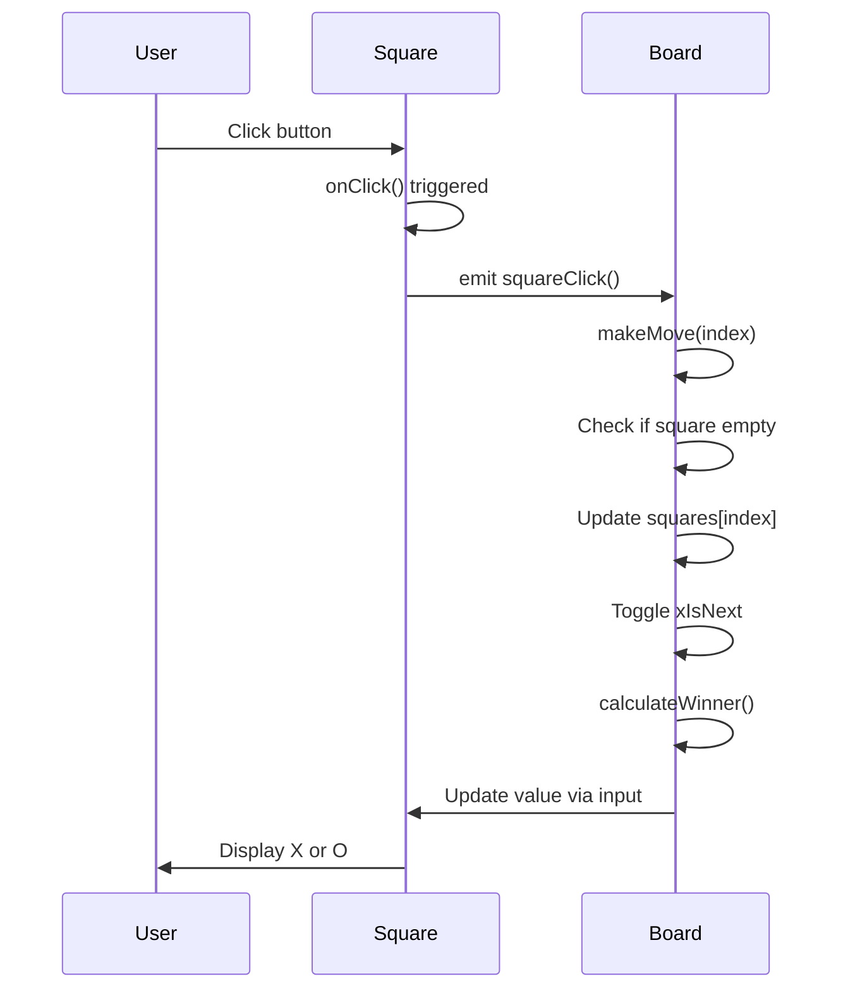

# 🎮 Tic-Tac-Toe Game

<div align="center">


**A modern, interactive Tic-Tac-Toe game built with Angular 21, featuring clean architecture, signal-based inputs, and responsive design.**

[Live Demo](#) • [Report Bug](https://github.com/Pavan755/Tic-Tac-Toe/issues) • [Request Feature](https://github.com/Pavan755/Tic-Tac-Toe/issues)

</div>

---

## 📋 Table of Contents

- [Overview](#-overview)
- [Features](#-features)
- [Architecture](#-architecture)
- [Project Structure](#-project-structure)
- [Component Workflow](#-component-workflow)
- [Getting Started](#-getting-started)
- [Code Walkthrough](#-code-walkthrough)
- [Common Errors & Solutions](#-common-errors--solutions)
- [Development Journey](#-development-journey)
- [Technologies Used](#-technologies-used)
- [Contributing](#-contributing)
- [License](#-license)

---

## 🎯 Overview

This is a classic **two-player Tic-Tac-Toe game** built with Angular 21's latest features, including:
- **Signal-based inputs** for reactive data flow
- **Modern control flow syntax** (`@for`, `@if`)
- **Component composition** with smart parent-child communication
- **CSS Grid** for responsive layout
- **Event emitters** for custom events

Perfect for learning Angular's modern features or as a starting point for game development!

---

## ✨ Features

| Feature | Description |
|---------|-------------|
| 🎲 **Two-Player Mode** | Take turns playing as X and O |
| 🏆 **Winner Detection** | Automatically detects winners across rows, columns, and diagonals |
| 🔄 **Game Reset** | Start a new game instantly with the click of a button |
| 🎨 **Modern UI** | Clean, responsive design with hover effects |
| 📱 **Responsive Layout** | CSS Grid-based 3×3 board that works on all screen sizes |
| ⚡ **Real-time Updates** | Instant feedback on player turns and game status |

---

## 🏗️ Architecture

This project follows Angular's component-based architecture with clear separation of concerns:

```
┌─────────────────────────────────────────┐
│             App Component                │
│         (Root Component)                 │
└─────────────┬───────────────────────────┘
              │
              │ includes
              ▼
┌─────────────────────────────────────────┐
│          Board Component                 │
│   • Game logic & state management        │
│   • Winner detection algorithm           │
│   • Player turn tracking                 │
│   • Square array management              │
└─────────────┬───────────────────────────┘
              │
              │ renders 9×
              ▼
┌─────────────────────────────────────────┐
│         Square Component                 │
│   • Displays X, O, or empty              │
│   • Emits click events                   │
│   • Signal-based input/output            │
└─────────────────────────────────────────┘
```

---

## 📁 Project Structure

```
Tic-Tac-Toe/
│
├── src/
│   ├── app/
│   │   ├── board/                    # Board component (game logic)
│   │   │   ├── board.ts              # Component with game state & logic
│   │   │   ├── board.html            # 3×3 grid template
│   │   │   └── board.css             # Grid layout & button styles
│   │   │
│   │   ├── square/                   # Square component (individual cell)
│   │   │   ├── square.ts             # Component with input/output signals
│   │   │   ├── square.html           # Button template
│   │   │   └── square.css            # Square styling
│   │   │
│   │   ├── app.ts                    # Root component
│   │   ├── app.html                  # Root template
│   │   ├── app.css                   # Global styles
│   │   └── app.routes.ts             # Routing configuration
│   │
│   ├── index.html                    # Main HTML file
│   ├── main.ts                       # Application bootstrap
│   └── styles.css                    # Global styles
│
├── angular.json                      # Angular CLI configuration
├── tsconfig.json                     # TypeScript configuration
└── package.json                      # Dependencies & scripts
```

---

## 🔄 Component Workflow

### Data Flow Diagram



### Game Flow



---

## 🚀 Getting Started

### Prerequisites

- **Node.js**: v18 or later
- **npm**: v9 or later
- **Angular CLI**: v21.2.0 or later

### Installation

1. **Clone the repository**
   ```bash
   git clone https://github.com/Pavan755/Tic-Tac-Toe.git
   cd Tic-Tac-Toe/Tic-Tac-Toe
   ```

2. **Install dependencies**
   ```bash
   npm install
   ```

3. **Start the development server**
   ```bash
   ng serve
   ```

4. **Open your browser**
   ```
   Navigate to http://localhost:4200/
   ```

The application will automatically reload when you make changes to the source files.

### Build for Production

```bash
ng build --configuration production
```

Build artifacts will be stored in the `dist/` directory.

---

## 💻 Code Walkthrough

### 1. Board Component (`board.ts`)

**Purpose**: Manages the game state and logic

```typescript
export class Board {
  squares: any[] = [];           // Array of 9 squares
  xIsNext: boolean = true;       // Track current player
  winner: string | null = null;  // Store winner

  // Initialize new game
  newGame() {
    this.squares = Array(9).fill(null);
    this.winner = null;
    this.xIsNext = true;
  }

  // Get current player
  get player() {
    return this.xIsNext ? 'X' : 'O';
  }

  // Handle square click
  makeMove(idx: number) {
    if (!this.squares[idx] && !this.winner) {
      this.squares[idx] = this.player;
      this.xIsNext = !this.xIsNext;
      this.winner = this.calculateWinner();
    }
  }

  // Check all winning combinations
  calculateWinner() {
    const lines = [
      [0, 1, 2], [3, 4, 5], [6, 7, 8],  // Rows
      [0, 3, 6], [1, 4, 7], [2, 5, 8],  // Columns
      [0, 4, 8], [2, 4, 6]              // Diagonals
    ];

    for (let i = 0; i < lines.length; i++) {
      const [a, b, c] = lines[i];
      if (this.squares[a] && 
          this.squares[a] === this.squares[b] && 
          this.squares[a] === this.squares[c]) {
        return this.squares[a];
      }
    }
    return null;
  }
}
```

**Key Concepts:**
- **State Management**: Tracks squares, current player, and winner
- **Game Logic**: Validates moves and detects winners
- **Getter Method**: Computed property for current player

---

### 2. Board Template (`board.html`)

```html
<!-- Display game status -->
<h1>{{ winner ? winner + ' is the winner!' : 'Current player: ' + player }}</h1>

<!-- Reset button -->
<button (click)="newGame()">Start new Game</button>

<!-- 3×3 Grid -->
<main>
  @for (val of squares; track $index) {
    <app-square [value]="val" (squareClick)="makeMove($index)" />
  }
</main>
```

**Key Concepts:**
- **Template Expressions**: Dynamic content with `{{ }}`
- **Event Binding**: `(click)` for user interactions
- **Control Flow**: `@for` loop (Angular 17+ syntax)
- **Property Binding**: `[value]` passes data to child
- **Event Binding**: `(squareClick)` receives events from child

---

### 3. Square Component (`square.ts`)

**Purpose**: Represents a single square on the board

```typescript
export class Square {
  value = input<'X' | 'O' | null>(null);  // Signal-based input
  squareClick = output<void>();           // Event emitter

  onClick() {
    this.squareClick.emit();  // Notify parent
  }
}
```

**Key Concepts:**
- **Signal Inputs**: Modern reactive input using `input()`
- **Signal Outputs**: Type-safe event emitter using `output()`
- **Event Propagation**: Child notifies parent of clicks

---

### 4. Square Template (`square.html`)

```html
<button (click)="onClick()">{{ value() }}</button>
```

**Key Concepts:**
- **Signal Value Access**: Call `value()` as a function (signals are functions)
- **Event Handling**: Button click triggers `onClick()`

---

### 5. Styling (`board.css`)

```css
/* 3×3 Grid Layout */
main {
  display: grid;
  grid-template-columns: repeat(3, 100px);
  grid-template-rows: repeat(3, 100px);
  gap: 5px;
  background-color: #34495e;
  padding: 5px;
  border-radius: 10px;
}
```

**Key Concepts:**
- **CSS Grid**: Creates perfect 3×3 layout
- **Responsive Design**: Fixed size squares with flexible container
- **Visual Feedback**: Hover effects and colors

---

## 🐛 Common Errors & Solutions

### Error 1: **Unterminated String Literal**

**Location**: `square.ts` line 6

**Problem**:
```typescript
templateUrl: '
  <p>{{rando}}</p>',
```

**Error Message**:
```
Unterminated string literal.
```

**Cause**: Multi-line string without proper syntax

**Solution**:
```typescript
templateUrl: './square.html',  // Reference external file
// OR
template: '<p>{{rando}}</p>',  // Use template for inline HTML
```

**Lesson**: Use `templateUrl` for external files, `template` for inline HTML.

---

### Error 2: **Decorator Syntax Error**

**Location**: `square.ts` line 10

**Problem**:
```typescript
@input() value: 'X' | 'O' | null = null;
```

**Error Message**:
```
'input()' accepts too few arguments to be used as a decorator here.
```

**Cause**: `input()` is a signal function in Angular 17+, not a decorator

**Solution**:
```typescript
value = input<'X' | 'O' | null>(null);  // Signal-based input
```

**Lesson**: Angular 17+ uses `input()` and `output()` functions instead of `@Input()` and `@Output()` decorators.

---

### Error 3: **Property Not Initialized**

**Location**: `board.ts` lines 11-13

**Problem**:
```typescript
squares: any[];      // No initialization
xIsNext: boolean;
winner: string | null;
```

**Error Message**:
```
Property 'squares' has no initializer and is not definitely assigned in the constructor.
```

**Cause**: TypeScript strict mode requires initialization

**Solution**:
```typescript
squares: any[] = [];
xIsNext: boolean = true;
winner: string | null = null;
```

**Lesson**: Always initialize class properties or mark them as optional (`?`) or use `!` (definite assignment assertion).

---

### Error 4: **Method Nesting Error**

**Location**: `board.ts` line 37

**Problem**:
```typescript
makeMove(idx: number) {
  // ... code ...
  
  calculateWinner() {  // Nested inside makeMove!
    // ... code ...
  }
}
```

**Error Message**:
```
';' expected.
Cannot find name 'calculateWinner'.
```

**Cause**: Method defined inside another method (invalid syntax)

**Solution**:
```typescript
makeMove(idx: number) {
  // ... code ...
}  // Close makeMove

calculateWinner() {  // Separate method
  // ... code ...
}
```

**Lesson**: Methods must be defined at the class level, not nested inside other methods.

---

### Error 5: **Control Flow Syntax Error**

**Location**: `board.html` line 9

**Problem**:
```html
@for (let val of squares; track $index) {
```

**Error Message**:
```
NG5002: Cannot parse expression. The @for expression must match pattern "<identifier> of <expression>"
```

**Cause**: Angular's new control flow doesn't use `let` keyword

**Solution**:
```html
@for (val of squares; track $index) {
```

**Lesson**: Angular 17+ control flow syntax (`@for`, `@if`) has different syntax than `*ngFor` and `*ngIf`.

---

### Error 6: **Click Event Not Working**

**Location**: `board.html` line 11

**Problem**:
```html
<app-square [value]="val" (click)="makeMove($index)" />
```

**Cause**: Click event on custom component doesn't propagate to internal button

**Solution**:
1. Add output in `square.ts`:
```typescript
squareClick = output<void>();

onClick() {
  this.squareClick.emit();
}
```

2. Update `square.html`:
```html
<button (click)="onClick()">{{ value() }}</button>
```

3. Update `board.html`:
```html
<app-square [value]="val" (squareClick)="makeMove($index)" />
```

**Lesson**: Custom components need explicit event emitters for parent-child communication.

---

### Error 7: **Typo in Property Name**

**Location**: Throughout `board.ts`

**Problem**:
```typescript
sqaures: any[] = [];  // Typo: "sqaures" instead of "squares"
```

**Cause**: Spelling mistake causing inconsistent property access

**Solution**: Find and replace all instances:
```typescript
squares: any[] = [];  // Correct spelling
```

**Lesson**: Use consistent naming and IDE autocomplete to avoid typos.

---

## 📚 Development Journey

### Step 1: Project Setup
```bash
ng new Tic-Tac-Toe --standalone
cd Tic-Tac-Toe
```

### Step 2: Generate Components
```bash
ng generate component square
ng generate component board
```

### Step 3: Implement Square Component
- Created signal-based input for value
- Added output event emitter
- Implemented click handler
- Styled button with CSS

### Step 4: Implement Board Component
- Created game state (squares, xIsNext, winner)
- Implemented `newGame()` method
- Implemented `makeMove()` method
- Implemented `calculateWinner()` algorithm
- Created 3×3 grid layout with CSS Grid

### Step 5: Connect Components
- Imported Square into Board
- Imported Board into App
- Set up property and event bindings
- Fixed all TypeScript errors

### Step 6: Testing & Debugging
- Fixed unterminated string literals
- Corrected decorator syntax
- Resolved initialization errors
- Fixed method nesting issues
- Corrected control flow syntax
- Fixed click event propagation

### Step 7: Styling
- Added CSS Grid layout
- Implemented hover effects
- Created responsive design
- Added game status display

---

## 🛠️ Technologies Used

| Technology | Purpose |
|------------|---------|
| **Angular 21** | Frontend framework |
| **TypeScript** | Type-safe JavaScript |
| **CSS Grid** | Layout system |
| **RxJS** | Reactive programming (built into Angular) |
| **Angular Signals** | Modern reactivity system |
| **Angular CLI** | Project scaffolding and build tools |

---

## 🎓 Key Learning Points

1. **Signal-Based Architecture**: Modern Angular uses `input()` and `output()` instead of decorators
2. **Control Flow Syntax**: `@for`, `@if` replace `*ngFor`, `*ngIf`
3. **Component Communication**: Parent-child data flow with inputs and custom events
4. **CSS Grid**: Powerful layout system for game boards
5. **Game Logic**: Winner detection algorithm using array combinations
6. **TypeScript Best Practices**: Proper typing, initialization, and error handling
7. **Event Propagation**: How custom components handle click events

---

## 🤝 Contributing

Contributions are welcome! Here's how you can help:

1. **Fork the repository**
2. **Create a feature branch**
   ```bash
   git checkout -b feature/amazing-feature
   ```
3. **Commit your changes**
   ```bash
   git commit -m 'Add amazing feature'
   ```
4. **Push to the branch**
   ```bash
   git push origin feature/amazing-feature
   ```
5. **Open a Pull Request**

### Ideas for Contributions

- 🤖 Add AI opponent (single-player mode)
- 📊 Add score tracking across multiple games
- 🎨 Add theme customization
- ♿ Improve accessibility
- 🌐 Add internationalization (i18n)
- 📱 Improve mobile responsiveness
- 🎵 Add sound effects
- ⏱️ Add game timer

---

## 📄 License

This project is licensed under the MIT License - see the [LICENSE](LICENSE) file for details.

---

## 👨‍💻 Author

**Pavan755**

- GitHub: [@Pavan755](https://github.com/Pavan755)
- Repository: [Tic-Tac-Toe](https://github.com/Pavan755/Tic-Tac-Toe)

---

## 🙏 Acknowledgments

- Angular Team for the amazing framework
- Angular CLI for streamlined development
- The open-source community for inspiration

---

<div align="center">

**⭐ Star this repo if you found it helpful! ⭐**

Made with ❤️ using Angular

</div>
